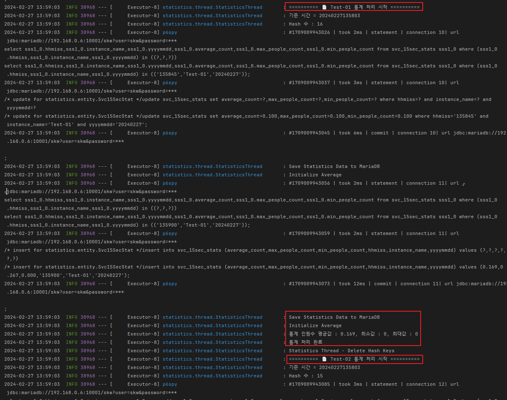
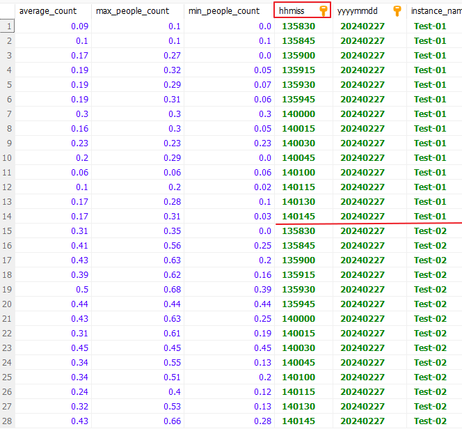
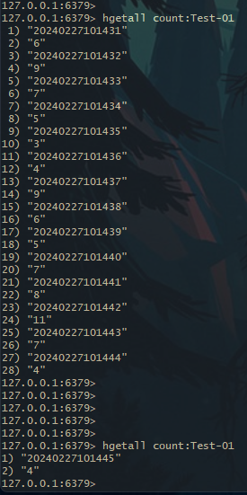
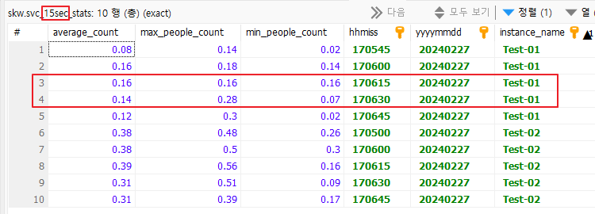
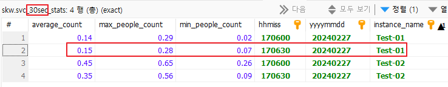

# Redis 통계 처리

AI Engine에서 분석된 RTSP Stream(IP Cam)의 특정영역 면적당 평균 인원수 점유 모니터링 및 통계

---

## 📘 Initialize RabbitMQ Connections

- RabbitMQ Connection Factory(1개 서버)당 1개의 Connection Factory, Connection 생성
- Connection 당 n개의 RabbitMQ Channel 생성 (각각 별개의 스레드로 Run)
- Received Data 트래픽 부하 분산(Channels)
- 총 Consumer 개수 = RabbitMQ Channel 수
- 이 Repository에서는 임의로 1개의 서버만 적용
- Queue는 Topic 기반의 **Quorum Queue 사용**

 

### Event Image Decoding (PNG)

- RabbitMQ Channel에서 Basic Consume으로 받은 Base64 Encoded Image Data 변환

---

## 📘 통계 데이터 쌓기

- [View Code](https://github.com/spacedustz/Statistics/blob/main/Statistics/src/main/java/statistics/service/rabbit/EventDeliveryCallBack.java)
- RabbitMQ에서 Event Data를 Consume 하자마자 MariaDB, Redis Hash에 TimeStamp, count값 등록
- AI 영상 분석 영역의 인원수 / 면적값 = Average 값과 알람 레벨 상태 기록
- Redis Hash의 Value에 따라 TimeStamp 상 15초 기준 통계 데이터 생성
- Alarm Count Interval 값(Milli Second)만큼의 차이가 발생하면 알람 레벨 변경 및 TimeStamp Update
- 15초 데이터 기준으로 30초, 1분, 5분, 10분, 1시간 데이터 생성
- MariaDB 테이블 파티셔닝

 

### 통계 데이터 쌓기

**영역 내 인원수 통계**

 

**현재 알람 레벨**

 

**마지막 알람레벨 TimeStamp**

---

## 📘 Data Grouping

### TimeStamp 15초 기준으로 Grouping

- 각 인스턴스 별 Redis Hash에 쌓인 통계 데이터를 TimeStamp를 기준으로 15초씩 TreeMap으로 Sort
- Hash Value인 인원 수 값들의 평균을 average_count(Big Decimal) 로 할당
- Hash Value의 15초 평균의 Max, Min 값을 Big Decimal로 계산하여 할당
- MariaDB 저장 후 Redis Hash 제거

 

 

**Redis Hash 내에 TimeStamp가 15초가 되고 MariaDB에 저장후 Hash 삭제**

 

### 15초 통계 데이터 기준으로 30초 데이터 생성

- 15초 데이터 2개의 average_count 값을 다시 AVG한 값을 average_count에 할당
- 15초 데이터 2개의 Max, Min 값중 Max 2개중 큰값, Min 2개중 작은 값을 Max, Min에 할당
- 아래 두 사진은 15~30초에 해당하는 15초 통계 2개의 데이터를 가지고 30초 통계 1개를 만듬

 

### 15초 통계 데이터 기준으로 1분 데이터 생성

- 진행중

 

### 15초 통계 데이터 기준으로 15분 데이터 생성

- 진행중

 

### 15초 통계 데이터 기준으로 1시간 데이터 생성

- 진행중