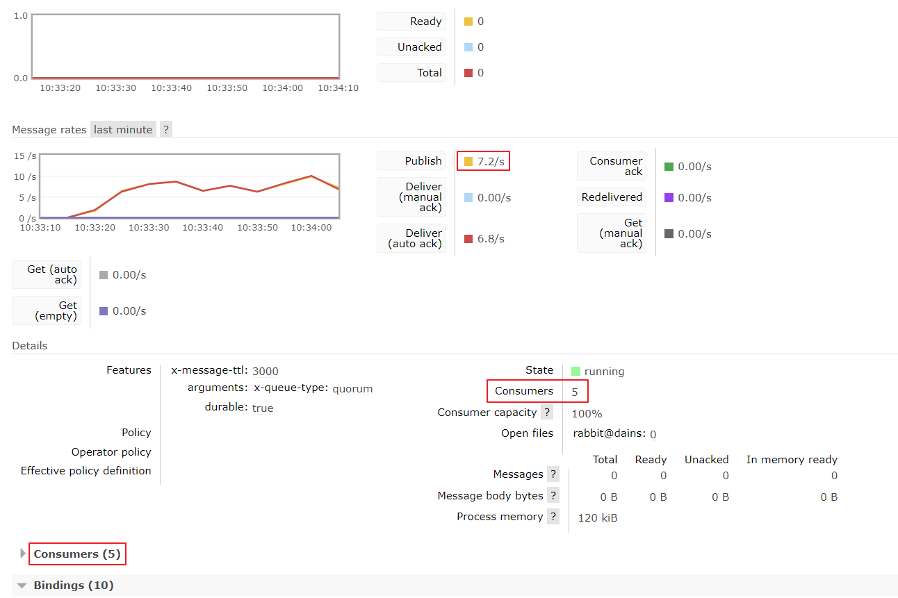

## 📘 Redis 통계 처리

AI Engine에서 분석된 RTSP Stream(IP Cam)의 특정영역 면적당 평균 인원수 점유 모니터링 및 통계

 

### Initialize RabbitMQ Connections

- RabbitMQ Connection Factory(1개 서버)당 1개의 Connection Factory, Connection 생성
- Connection 당 n개의 RabbitMQ Channel 생성 (각각 별개의 스레드로 Run)
- Received Data 트래픽 부하 분산(Channels)
- 총 Consumer 개수 = RabbitMQ Channel 수
- 이 Repository에서는 임의로 1개의 서버만 적용
- Queue는 Topic 기반의 **Quorum Queue 사용**

 

### Event Image Decoding (PNG)

- RabbitMQ Channel에서 Basic Consume으로 받은 Base64 Encoded Image Data 변환

 

### 통계 처리 (진행중)

- Redis Hash의 Value에 따라 15초 기준 통계 데이터 생성
- 15초 데이터 기준으로 30초, 1분, 5분, 10분, 1시간 데이터 생성
- MariaDB 테이블 파티셔닝